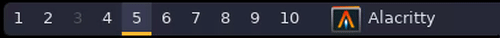

# Ixwindow – iconized xwindow 

## About
Ixwindow is an improved version of the standard `xwindow` polybar module. The
main feature is that `ixwindow` displays not only info about active window,
but also an icon for it. It also allows you more customization of printing
window info, than regular `xwindow` polybar module. Below is represented a 
demonstration of what `ixwindow` looks like in action:

<p align="center">
  
</p>


**Note:** basically, it doesn't really depend on polybar itself, it can be used 
with any other bar as well, you just need to implement the same behavior,
as polybar's `tail = true`.

## Features
- Because it is written in Rust, it is blazingly fast
- Automatic icon generation
- High quality of displayed icons
- Flexible configuration of what gets printed
- Native support for `bspwm` via
  [`bspc-rs`](https://github.com/andreykaere/bspc-rs) library, which was
  started with the need for this project

## Dependencies
- [`cargo`](https://github.com/rust-lang/cargo)

For cargo installation instructions, see [here](https://github.com/rust-lang/cargo).

## Downloading

If you want to install stable version, then you should download the source code 
from the `master` branch using the following command:
```bash
git clone git@github.com:andreykaere/ixwindow.git && cd ixwindow
```
If you want the bleeding edge version, switch to `dev` branch.

### Installation

To install it to your system you just have to run `./install` . 
To see installation options run `./install --help`. 
You will also need to add the following to your polybar `config` file:
```dosini
[module/ixwindow]
type = custom/script
exec = /path/to/ixwindow
tail = true
```
and put it somewhere on bar, for example, add it right next to your window
manager: `modules-left = <wm> ixwindow`. 

If you have multi monitors setup, then you need to have distinct bar for
each of them and create modules like this:
```dosini
[module/ixwindow1]
type = custom/script
exec = /path/to/ixwindow <name_of_monitor_1>
tail = true

[module/ixwindow2]
type = custom/script
exec = /path/to/ixwindow <name_of_monitor_2>
tail = true
...
```
and then put these modules on respective bars:
```dosini
...
; Bar for monitor1
[bar/bar1]
...
modules-left = <wm> ixwindow1
...

; Bar for monitor2
[bar/bar2]
...
modules-left = <wm> ixwindow2
...

...
```

You will also need a config file for `ixwindow`. Example of this file you may
find in `examples/ixwindow.toml`. For more info see the section below.

## Configuration

Default configuration file is supposed to be located at
`$XDG_CONFIG_HOME/ixwindow/ixwindow.toml`. If you want it to be located
somewhere else, you should specify that in environmental variable
`IXWINDOW_CONFIG_PATH`, or run `ixwindow` script with
`--config=<path_to_config>` option.

In config file, there are various options, that can be modified (example of
configuration file can be found in `examples/ixwindow.toml`), such as:
```toml
# Path to folder for the cached icons 
# Note: it makes sense to keep it around `.config/polybar` folder, so you won't
# lose your custom icons, if you have them
cache_dir = "path/to/cache/directory"

# This represents the size of the icon in pixels, for example:
size = 24

# This represents background color of the polybar bar. Color should be
# specified in hex format:
color = "#RRGGBB"

# Absolute coordinates of the icon in pixels, for example: 
x = 270
y = 6

# Amound of spaces in the output of the `ixwindow`. This is needed to add
# space between previous module and the title of the window
# It's recommended to be configured together with the coordinates of the icon 
# to achieve the best result
gap = "<spaces>"


# For i3 (but if there will be request, can be easily added for bspwm as
# well). 
#
# This variable is used for calculation of the position of the icon, when the number 
# of active desktops is dynamic, i.e. is not constant and can be changed when
# new nodes are added. This setting is optional and if it is not set, it
# means, that the icon position will be static.
# 
# For more accurate configuration, floating numbers are acceptable. For
# example:
gap_per_desk = 24.0
```
To change your configuration, just edit your config file. For new settings to
take affect, you have to restart polybar (for example with `polybar-msg cmd
restart`).

## Generating icons

`ixwindow` uses the X11 atom `_NEW_WM_ICON` for generating icons automatically. 
Most of the times it works, but for some applications, this field may be empty
and there is no way to generate it automatically. In this case, if you want to 
have an icon for these applications, you have to add them manually. 

<!-- For information how to do it, see the section below. -->

<!-- ### Adding custom icons -->

<!-- To replace or add custom icons, you need to have `png` or `svg` version -->
<!-- of the icon, named as `WM_CLASS` (which you can find by running `xprop -->
<!-- WM_CLASS` and selecting your app). Then you run the following command -->
<!-- (requires `imagemagick`): --> 
<!-- ```bash -->
<!-- ixwindow-convert --size <size> --color <color> --cache <chache_dir> <icon-name> -->
<!-- ``` -->
<!-- where `<icon-name>` is the right name as described above. This will convert -->
<!-- icon to `jpg` format with appropriate background color and move to your cache --> 
<!-- directory. --> 

<!-- **Note:** Almost all apps have their icons on your system in `png` or `svg` -->
<!-- format. Usually, one can find it somewhere in `/usr/share/icons` directory -->
<!-- (for example using `find` or `fd` utility for it). -->

<!-- You can try it out on some icons located in `examples/custom-icons` folder. -->

## Known issues & limitations

- Lack of png support, but replacing `jpg` with `png` would require compositor 
as the dependency as well
- Manual specification, but seems to be unfixable at this point, since polybar 
doesn't support inserting images into bar for now

Feel free to open issue if you have any questions or you've noticed a bug.
Also pull requests are welcome; don't hesitate to crate one, if you have a
solution to any of the issues, stated above.

## Goals

- Add png support (maybe make it an option, if user doesn't use compositor)

- Rewrite `ixwindow-convert` in Rust. It was removed for now, because with
  Rust implementation there is no much need in it. However I think it would be
  nice to have it anyway

- Add options for `print_info` function, i.e. print different information.
  Maybe add support for `xwindow` options (in polybar).

## Thanks

### Inspired by

I got inspired to start this project, when I saw similar feature in
`awesome-wm`. I thought it would be hard to simulate the exact same behavior
on polybar, however I came across
[this](https://github.com/MateoNitro550/xxxwindowPolybarModule) project and I
thought, that I can just improve the default `xwindow`, by formatting its
output a bit and adding icon of the focused application.

### With a great help of

I would like to thank  [psychon](https://github.com/psychon) for helping me 
understand `x11rb` and xorg in general, which made it possible to rewrite code
in rust and drastically improve that project.

